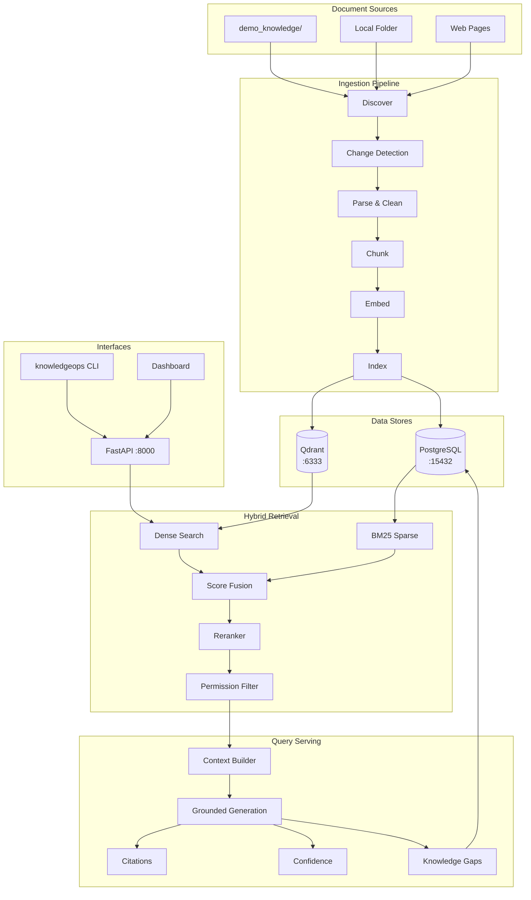
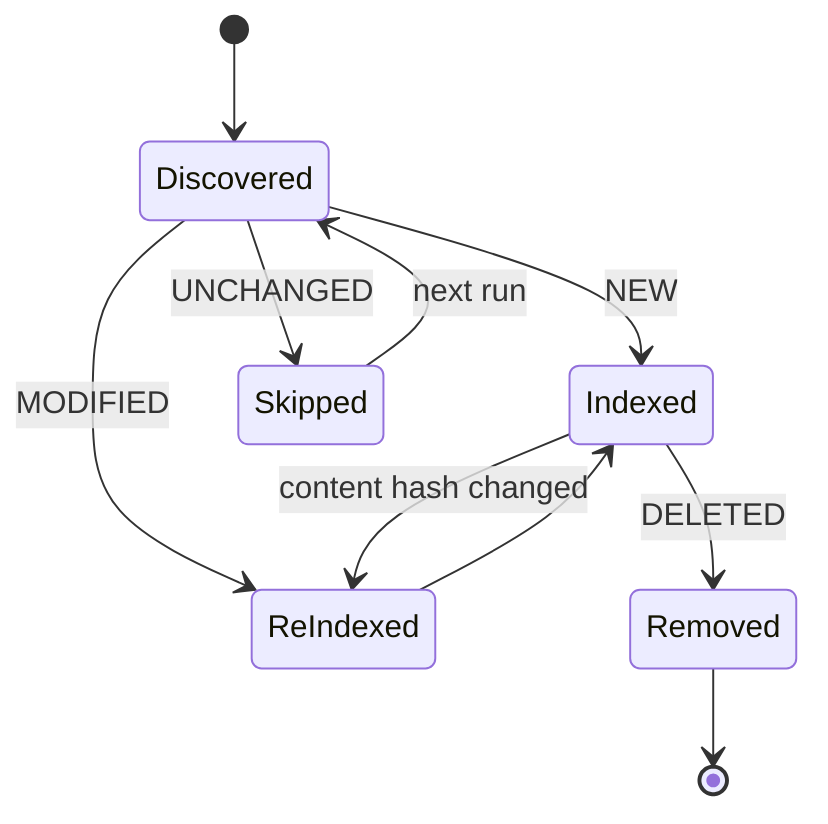

# KnowledgeOps RAG Automation Platform

Self-maintaining RAG knowledge automation platform with hybrid retrieval, incremental ingestion, evaluation, and knowledge-gap tracking.

See [FAILURES.md](./FAILURES.md) for what can go wrong, what broke, how it was fixed, and results.

[](https://www.python.org/downloads/)
[](BUILD_REPORT.md)
[](BUILD_REPORT.md)

---

## Overview

KnowledgeOps automates the full lifecycle of an internal knowledge base. It discovers documents from configurable sources, detects changes via content hashing, chunks and embeds only what changed, indexes vectors in Qdrant, and serves grounded answers through a hybrid retrieval pipeline with citations, confidence scoring, and permission filtering.

When the system cannot answer a question, it records a **knowledge gap** — turning failed searches into actionable content priorities.

---

## The Problem

Enterprise knowledge is scattered across policies, runbooks, and guidelines that change frequently. Employees ask the same questions repeatedly. Static chatbots go stale. Manual RAG pipelines waste compute re-embedding unchanged documents. Ungoverned retrieval risks leaking restricted content.

---

## The Solution

KnowledgeOps provides:

- **Incremental ingestion** — content-hash change detection skips unchanged documents
- **Document versioning** — full version history with audit trail
- **Hybrid retrieval** — dense semantic + BM25 lexical search with reranking
- **Grounded generation** — evidence-only answers with citations
- **Knowledge-gap automation** — systematic tracking of unanswered questions
- **Deterministic evaluation** — 60-question benchmark with regression baselines
- **Permission filtering** — department-scoped retrieval before generation

---

## Why This Is More Than a Chatbot

| Chatbot tutorial | KnowledgeOps |
|---|---|
| Upload PDF, ask questions | Automated discovery from multiple sources |
| Re-index everything each run | Change detection: 40 unchanged, 0 re-indexed |
| Vector search only | Hybrid dense + BM25 + reranking |
| No citations | Structured citations with version metadata |
| Guesses when unsure | Refuses + creates knowledge-gap records |
| No evaluation | `main_eval` with MRR 0.625, NDCG@5 0.702 |
| No access control | Permission filtering by user group |

---

## Features

- Multi-format parsing (PDF, DOCX, Markdown, TXT, HTML)
- Sentence-aware chunking with heading preservation
- Local embeddings via `sentence-transformers/all-MiniLM-L6-v2`
- Qdrant vector store with metadata payload filtering
- Cross-encoder reranking
- Transparent confidence scoring from retrieval signals
- FastAPI REST API + web dashboard
- Typer CLI with Rich terminal output
- Prefect ingestion workflow with retries
- Docker Compose local stack
- GitHub Actions CI (no paid API keys required)

---

## Architecture



See [ARCHITECTURE.md](ARCHITECTURE.md) for detailed flow diagrams.

---

## Automated Knowledge Lifecycle



---

## RAG Pipeline

1. **Discover** documents from configured sources
2. **Detect changes** via content hash (NEW / UNCHANGED / MODIFIED / DELETED)
3. **Parse** with format-specific parsers (PDF, DOCX, MD, TXT, HTML)
4. **Clean** text deterministically (whitespace, boilerplate, encoding)
5. **Chunk** with sentence-aware strategy (512 tokens, 64 overlap)
6. **Embed** in batches of 32 (skip unchanged chunk hashes)
7. **Index** vectors in Qdrant + metadata in PostgreSQL
8. **Retrieve** with hybrid dense + BM25 fusion
9. **Rerank** with cross-encoder
10. **Filter** by user group permissions
11. **Generate** grounded answer with citations
12. **Score** confidence from retrieval signals
13. **Record** knowledge gaps when evidence is insufficient

---

## Hybrid Retrieval

| Stage | Configuration |
|---|---|
| Dense top-k | 20 (Qdrant cosine) |
| Sparse top-k | 20 (BM25) |
| Fusion alpha | 0.5 |
| Rerank top-k | 8 |
| Context top-k | 5 |

Measured retrieval quality on `main_eval` (60 questions, k=5):

| Metric | Value |
|---|---|
| MRR | 0.625 |
| Hit Rate @ 5 | 0.633 |
| Precision @ 5 | 0.573 |
| Recall @ 5 | 0.633 |
| NDCG @ 5 | 0.702 |

---

## Reranking

Retrieval casts a wide net (top 30 fused candidates); a local cross-encoder reranker narrows to the top 8 before context construction. Both retrieval and rerank scores are exposed in debug output.

---

## Document Versioning

Every document maintains a version chain in PostgreSQL:

- Content hash triggers new version on modification
- Previous version linked for audit trail
- API: `GET /api/v1/documents/{id}/versions`
- Citations include document version for traceability

---

## Knowledge Gap Detection

When retrieval confidence falls below threshold or the generator reports insufficient evidence, KnowledgeOps creates a knowledge-gap record with the question, timestamp, best retrieval score, and frequency count. Gaps are queryable via API and visible on the dashboard.

---

## Evaluation

```bash
make evaluate
# or
knowledgeops evaluate --dataset main_eval --top-k 5
```

- **Dataset:** `evals/datasets/main_eval.json` (60 questions)
- **Baseline:** `evals/datasets/baseline_metrics.json`
- **Quality gates:** Hit Rate @ 5 ≥ 0.6, MRR ≥ 0.5 (both pass)
- **Regression tolerance:** 0.05

---

## Security

Permission filtering, grounding enforcement, confidence gating, and secrets management are documented in [SECURITY.md](SECURITY.md).

Key points:

- Chunks carry `allowed_groups` metadata
- `PermissionFilter` runs before context reaches the LLM
- Default demo has no API authentication — not production-ready
- PostgreSQL exposed on port **15432** (non-default) for local dev only

---

## Quick Start

### Prerequisites

- Python 3.12+
- Docker and Docker Compose (for PostgreSQL + Qdrant)

### 1. Clone and install

```bash
git clone <repository-url>
cd knowledgeops-rag-platform
pip install -e ".[dev]"
cp .env.example .env
```

### 2. Start infrastructure

```bash
docker compose up -d postgres qdrant
```

PostgreSQL is available at `localhost:15432`. Qdrant at `localhost:6333`.

### 3. Initialise and ingest

```bash
make setup        # prepare demo knowledge base
make migrate      # run Alembic migrations
knowledgeops ingest --source demo
```

### 4. Start the API

```bash
knowledgeops api
# OpenAPI docs: http://localhost:8000/docs
# Dashboard:    http://localhost:8000/dashboard
```

### Full Docker stack

```bash
docker compose up -d
# API available at http://localhost:8000
```

---

## Demo

Run the 20-step case-study demonstration:

```bash
make demo
# or
knowledgeops demo
```

### Measured Demo Results

**Ingestion**

| Metric | Value |
|---|---|
| Documents discovered | 40 |
| Chunks indexed (first run) | 662 |
| Documents unchanged (second run) | 40 |
| Chunks re-indexed (second run) | 0 |

**Retrieval Quality** (`main_eval`, 60 questions)

| Metric | Value |
|---|---|
| MRR | 0.625 |
| Hit Rate @ 5 | 0.633 |
| Precision @ 5 | 0.573 |
| Recall @ 5 | 0.633 |
| NDCG @ 5 | 0.702 |

**Performance** (3-iteration benchmark)

| Stage | Mean |
|---|---|
| Ingestion (unchanged docs) | 0.234 s |
| Embedding batch | 0.027 s |
| Hybrid retrieval | 1099 ms |
| Full query | 1599 ms |

**Verified Scenarios**

- ✅ Document version change → selective re-index
- ✅ Document deletion → Qdrant sync
- ✅ Unsupported question → knowledge gap created
- ✅ Permission filtering → group-scoped retrieval

---

## API

Base URL: `http://localhost:8000/api/v1`

| Endpoint | Method | Description |
|---|---|---|
| `/query` | POST | Grounded question answering |
| `/search` | POST | Retrieval-only search |
| `/documents` | GET | List indexed documents |
| `/documents/{id}/versions` | GET | Version history |
| `/ingestion/run` | POST | Trigger ingestion |
| `/ingestion/runs` | GET | Ingestion run history |
| `/knowledge-gaps` | GET | Unanswered questions |
| `/evaluations/run` | POST | Run evaluation |
| `/analytics/summary` | GET | Usage analytics |
| `/health` | GET | Health check |

Example:

```bash
curl -X POST http://localhost:8000/api/v1/query \
  -H "Content-Type: application/json" \
  -d '{"query": "How many vacation days do employees get?", "user_group": "ENGINEERING"}'
```

---

## CLI

```bash
knowledgeops demo                          # 20-step case study demo
knowledgeops ingest --source demo          # Run ingestion
knowledgeops query "What is the VPN policy?" # Ask a question
knowledgeops search "leave policy"           # Retrieval only
knowledgeops documents                     # List documents
knowledgeops gaps                          # List knowledge gaps
knowledgeops evaluate --dataset main_eval  # Run evaluation
knowledgeops benchmark                     # Performance benchmark
knowledgeops status                        # System status
knowledgeops api                           # Start FastAPI server
```

---

## Testing

```bash
make test          # all tests
make test-unit     # unit tests only
make test-integration
make test-e2e
make lint          # ruff check
make typecheck     # mypy
```

| Result | Value |
|---|---|
| Tests passed | 49 |
| Coverage | 72% |

---

## Docker

```bash
make docker-build
make docker-up     # starts app + postgres + qdrant
make docker-down
```

| Service | Port | Notes |
|---|---|---|
| FastAPI app | 8000 | API + dashboard |
| PostgreSQL | **15432** | Non-default to avoid local conflicts |
| Qdrant | 6333 | REST API |

---

## Project Structure

```
knowledgeops-rag-platform/
├── app/
│   ├── api/routes/          # REST endpoints
│   ├── cli/                 # Typer CLI
│   ├── dashboard/           # Web dashboard
│   ├── db/models/           # SQLAlchemy models
│   ├── evaluation/          # Metrics, runner, regression
│   ├── generation/          # Grounded answers, citations
│   ├── ingestion/           # Pipeline, parsers, chunking
│   ├── knowledge_gaps/      # Gap tracking service
│   ├── providers/           # Embedding/generation abstractions
│   ├── repositories/        # Data access layer
│   ├── retrieval/           # Hybrid search, permissions
│   ├── schemas/             # Pydantic models
│   └── workflows/           # Prefect flows
├── config/
│   ├── ingestion.yaml
│   └── retrieval.yaml
├── demo_knowledge/          # 40 demo documents
├── docs/decisions/          # Architecture Decision Records
├── evals/datasets/          # Evaluation data + baselines
├── migrations/              # Alembic migrations
├── scripts/                 # Demo, benchmark, evaluation
├── tests/                   # unit, integration, e2e
├── ARCHITECTURE.md
├── BUILD_REPORT.md
├── CASE_STUDY.md
├── SECURITY.md
├── docker-compose.yml
├── Dockerfile
└── Makefile
```

---

## Engineering Decisions

Architecture Decision Records in [docs/decisions/](docs/decisions/):

| ADR | Topic |
|---|---|
| [001](docs/decisions/001-qdrant-vector-store.md) | Qdrant as vector store |
| [002](docs/decisions/002-hybrid-retrieval.md) | Hybrid dense + sparse retrieval |
| [003](docs/decisions/003-provider-abstraction.md) | Provider abstraction |
| [004](docs/decisions/004-document-versioning.md) | Content-hash versioning |
| [005](docs/decisions/005-rag-quality-gates.md) | RAG quality gates |
| [006](docs/decisions/006-permission-filtering.md) | Permission filtering |

---

## Limitations

- No API authentication in v0.1 (group permissions simulated via parameters)
- Default mock generation provider (swap to Ollama or commercial APIs for real LLM)
- CPU-bound retrieval (~1.1 s hybrid search on local hardware)
- 40-document demo corpus — not validated at enterprise scale
- 2 Ruff lint warnings and 16 mypy errors remain (see [BUILD_REPORT.md](BUILD_REPORT.md))

---

## Future Improvements

- OIDC authentication with JWT group claims
- Qdrant payload filters for permissions at query time
- SharePoint, Google Drive, S3 source connectors
- GPU-accelerated embedding and reranking
- OpenTelemetry distributed tracing
- Generation-quality evaluation with real LLM providers
- Horizontal ingestion workers via Prefect agent pool

---

## Documentation

| Document | Description |
|---|---|
| [CASE_STUDY.md](CASE_STUDY.md) | Professional engineering case study |
| [ARCHITECTURE.md](ARCHITECTURE.md) | System diagrams and flows |
| [SECURITY.md](SECURITY.md) | Security considerations |
| [BUILD_REPORT.md](BUILD_REPORT.md) | Implementation status and measured results |

---

## License

MIT — see [LICENSE](LICENSE).
